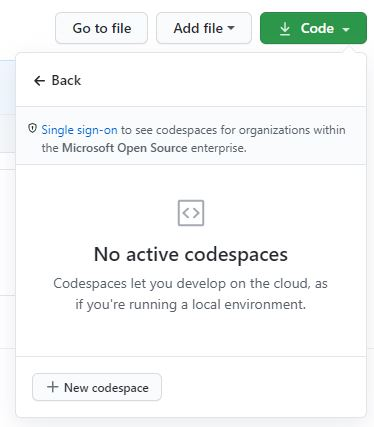
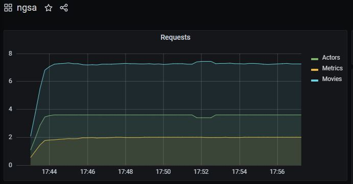
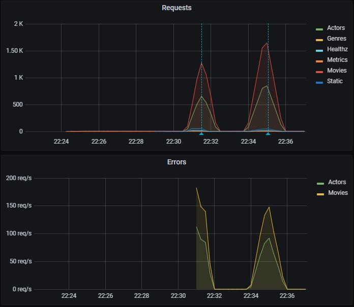

# Kind Dev Cluster on Codespaces Template

> Setup a Kubernetes Developer Cluster using `kind` or `k3d` running in [GitHub Codespaces](https://github.com/features/codespaces)


> [GitHub Codespaces](https://github.com/features/codespaces) is currently in preview

## Overview

This is a template that will setup a Kubernetes developer cluster using `Kind` and `GitHub Codespaces`

Create your repo from this template and add your application code

## Open with Codespaces

- Click the `Code` button on your repo
- Click `Open with Codespaces`
- Click `New Codespace`



## Open Workspace

- When prompted, choose `Open Workspace`

## Build and Deploy Cluster

By default the solution will create a `kind` cluster. If you want to use [k3d](https://k3d.io/), run the make commands from the `k3d` directory
  
  ```bash

  # (optional) use the k3d makefile
  cd k3d

  # build the cluster
  make all

  ```


## Validate Deployment

Output from `make all` should resemble this

```text

default      fluentb                                   1/1   Running   0   31s
default      jumpbox                                   1/1   Running   0   25s
default      loderunner                                1/1   Running   0   31s
default      ngsa-memory                               1/1   Running   0   33s
monitoring   grafana-64f7dbcf96-cfmtd                  1/1   Running   0   32s
monitoring   prometheus-deployment-67cbf97f84-tjxm7    1/1   Running   0   32s

# curl all of the endpoints
{ "apiVersion": "1.0", "appVersion": "0.1.1-0210-0338", "language": "C#" }

0.1.1-0210-0537

<a href="/graph">Found</a>.

<a href="/login">Found</a>.

```

## Validate deployment with k9s

- From the Codespace terminal window, start `k9s`
  - Type `k9s` and press enter
  - Press `0` to select all namespaces
  - Wait for all pods to be in the `Running` state (look for the `STATUS` column)
  - Use the arrow key to select `nsga-memory` then press the `l` key to view logs from the pod
  - To go back, press the `esc` key
  - To view other deployed resources - press `shift + :` followed by the deployment type (e.g. `secret`, `services`, `deployment`, etc).
  - To exit - `:q <enter>`


## Service endpoints

- All endpoints are usable in your browser via clicking on the `Ports (4)` tab
  - Select the `open in browser icon` on the far right
- Some popup blockers block the new browser tab
- If you get a gateway error, just hit refresh - it will clear once the port-forward is ready

```bash

# check endpoints
make check

```

### Other interesting endpoints

Open [curl.http](./curl.http)

> [curl.http](./curl.http) is used in conjuction with the Visual Studio Code [REST Client](https://marketplace.visualstudio.com/items?itemName=humao.rest-client) extension.
>
> When you open [curl.http](./curl.http), you should see a clickable `Send Request` text above each of the URLs


Clicking on `Send Request` should open a new panel in Visual Studio Code with the response from that request like so:


## Jump Box

A `jump box` pod is created so that you can execute commands `in the cluster`

- use the `kj` alias
  - `kubectl exec -it jumpbox -- bash -l`
    - note: -l causes a login and processes `.profile`
    - note: `sh -l` will work, but the results will not be displayed in the terminal due to a bug

- use the `kje` alias
  - `kubectl exec -it jumpbox --`
- example
  - run http against the ClusterIP
    - `kje http ngsa-memory:8080/version`

## Launch Grafana Dashboard

- Grafana login info
  - admin
  - akdc-512

- Once `make all` completes successfully
  - Click on the `ports` tab of the terminal window
  - Click on the `open in browser icon` on the Grafana port (32000)
  - This will open Grafana in a new browser tab


## View Grafana Dashboard

- Click on `Home` at the top of the page
- From the dashboards page, click on `NGSA`



## Run a load test

```bash

# from Codespaces terminal

# run a baseline test (will generate warnings in Grafana)
make test

# run a 60 second load test
make load-test

```

- Switch to the Grafana brower tab
- The test will generate 400 / 404 results
- The requests metric will go from green to yellow to red as load increases
  - It may skip yellow
- As the test completes
  - The metric will go back to green (1.0)
  - The request graph will return to normal



## View Prometheus Dashboard

- Click on the `ports` tab of the terminal window
- Click on the `open in browser icon` on the Prometheus port (30000)
- This will open Prometheus in a new browser tab

- From the Prometheus tab
  - Begin typing NgsaAppDuration_bucket in the `Expression` search
  - Click `Execute`
  - This will display the `histogram` that Grafana uses for the charts

## View Fluent Bit Logs

- Start `k9s` from the Codespace terminal
- Select `fluentb` and press `enter`
- Press `enter` again to see the logs
- Press `s` to Toggle AutoScroll
- Press `w` to Toggle Wrap
- Review logs that will be sent to Log Analytics when configured

## Build and deploy a local version of LodeRunner

- Switch back to your Codespaces tab

```bash

# from Codespaces terminal

# make and deploy a local version of LodeRunner to k8s
make loderunner

```

## Build and deploy a local version of ngsa-memory

- Switch back to your Codespaces tab

```bash

# from Codespaces terminal

# make and deploy a local version of ngsa-memory to k8s
make app

```

## Next Steps

> [Makefile](./Makefile) is a good place to start exploring

## FAQ

- Why don't we use helm to deploy Kubernetes manifests?
  - The target audience for this repository is app developers who are beginning their Kubernetes journey so we chose simplicity for the Developer Experience.
  - In our daily work, we use Helm for deployments and it is installed in the `.devcontainer` should you want to use it.

### Engineering Docs

- Team Working [Agreement](.github/WorkingAgreement.md)
- Team [Engineering Practices](.github/EngineeringPractices.md)
- CSE Engineering Fundamentals [Playbook](https://github.com/Microsoft/code-with-engineering-playbook)

## How to file issues and get help  

This project uses GitHub Issues to track bugs and feature requests. Please search the existing issues before filing new issues to avoid duplicates. For new issues, file your bug or feature request as a new issue.

For help and questions about using this project, please open a GitHub issue.

## Contributing

This project welcomes contributions and suggestions.  Most contributions require you to agree to a Contributor License Agreement (CLA) declaring that you have the right to, and actually do, grant us the rights to use your contribution. For details, visit <https://cla.opensource.microsoft.com>

When you submit a pull request, a CLA bot will automatically determine whether you need to provide a CLA and decorate the PR appropriately (e.g., status check, comment). Simply follow the instructions provided by the bot. You will only need to do this once across all repos using our CLA.

This project has adopted the [Microsoft Open Source Code of Conduct](https://opensource.microsoft.com/codeofconduct/). For more information see the [Code of Conduct FAQ](https://opensource.microsoft.com/codeofconduct/faq/) or contact [opencode@microsoft.com](mailto:opencode@microsoft.com) with any additional questions or comments.

## Trademarks

This project may contain trademarks or logos for projects, products, or services.

Authorized use of Microsoft trademarks or logos is subject to and must follow [Microsoft's Trademark & Brand Guidelines](https://www.microsoft.com/en-us/legal/intellectualproperty/trademarks/usage/general).

Use of Microsoft trademarks or logos in modified versions of this project must not cause confusion or imply Microsoft sponsorship.

Any use of third-party trademarks or logos are subject to those third-party's policies.
